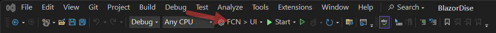
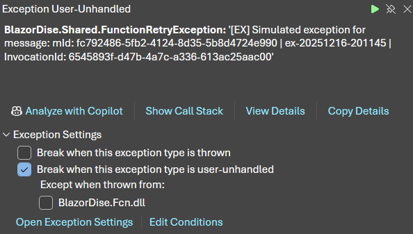

# Introduction

The purpose of **BlazorDise** (Blazor Paradise) is to demonstrate various scenarios of Blazor Server. It currently demonstrates the capabilities of Azure Storage and asynchronous handling of processing larger workloads separate from visitor access. This allows dynamic updates, including with reattachment. The purpose is to provide push updates, rather than polling. 

And, what proof-of-concept (POC) would be complete without theme music? [BlazorDise.mp3](./BlazorDise.mp3)

**Why is this being done?** To demonstrate technology capabilities, give back to the community, and take advantage of collaboration.

# Running Locally

Make sure to review this entire document. This is a technical implementation, which requires significant understanding of the technology stacks.

To run locally, select the *FCN > UI* configuration:



In the UI interface (e.g., https://localhost:7214), right-click on Monitor to open link in a new monitor. 

The Monitor selection allows viewing dynamic push updates from the Azure Function Queue Trigger. To get actual updates (turn on the listener), check *Capture All Messages* and click the *Monitor* button. 

The Home selection allows submission of jobs (do some work) that are consumed by the Azure Function Queue Trigger. 

For greater work effort, once can close the Monitor and activate it to show how updates will resume. One can even copy the URL and open to another browser (or private browser session) and monitor concurrently.

# Technologies

- Windows 11 development machine
- Visual Studio 2026 (Version 18.0.2+)
- .NET 10
- Azure Storage (separate or levering Azure Function App's Storage) or local Azure Storage Emulator[^1] (e.g., Azurite)
- Azure SignalR or local SignalR Emulator[^2]
- (Optional) Azure Function App
- (Optional) Azure App Service

For the Azure Function to run locally within Visual Studio, make sure to copy [local.sample.settings.json](./local.sample.settings.json) (and update as desired) to **local.settings.json**, as the latter file, purposely, is not included in source control. This file will appear, once created, in the Solution Explorer.

# Debugging

With .NET 10 (unlike .NET 8) and Visual Studio, unhandled exceptions in Azure Functions are caught by Visual Studio during debugging rather than allowing the Azure Function to catch the exception and restart the FunctionQueue as expected:



By using the custom exception [FunctionRetryException](./BlazorDise.Shared/FunctionRetryException.cs), this specific Exception can be **unchecked** to *Break when this exception type is user-unhandled*.

# Azure Resources

*All Azure Resources are optional as this application can be run locally.*

| Azure Resource Type | Plan                                     | Purpose                                                      |
| ------------------- | ---------------------------------------- | ------------------------------------------------------------ |
| Resource Group      | n/a                                      | Organization                                                 |
| SignalR             | Free_F1                                  | Push Notifications from Function App to Blazor Server        |
| Function App        | Consumption Serverless Plan - Dynamic Y1 | QueueTrigger (primary, supporting scalable operations across multiple functions), Azure Durable Function (example) |
| Storage Account     | (Part of Function App)                   | Function App support, Table (Status Tracking), Queue (QueueTrigger) |
| Web App             | B1                                       | Blazor Server UI                                             |

# Configuration

👀 The file [host.json](./BlazorDise.fcn/host.json) has configuration information for the Azure Function and Queue Trigger. This includes function timeouts, which is a maximum of 10 minutes for consumption plans.

The following configuration settings are implemented:

| Setting                      | Purpose                                                      | Locations Supported                                          | Project Used                  | Azure Service Example Settings                               | Local Development Emulator Example Settings                  |
| ---------------------------- | ------------------------------------------------------------ | ------------------------------------------------------------ | ----------------------------- | ------------------------------------------------------------ | ------------------------------------------------------------ |
| StorageAccountConnection     | Storage connection to hold state information to demonstrate progress. | secrets.json, App Service Environmental Variable             | BlazorDise.Fcn, BlazorDise.Ui | DefaultEndpointsProtocol=https;AccountName=\<storageaccountname>;AccountKey=\<accountkey>;EndpointSuffix=core.windows.net | UseDevelopmentStorage=true                                   |
| AzureSignalRConnectionString | Push Notification Support                                    | secrets.json, App Service Environmental Variable             | BlazorDise.Fcn, BlazorDise.Ui | Endpoint=https://\<signalrname>.service.signalr.net;AccessKey=\<accesskey>;Version=1.0; | Endpoint=http://localhost;Port=8888;AccessKey=ABCDEFGHIJKLMNOPQRSTUVWXYZ0123456789ABCDEFGH;Version=1.0; |
| ApplicationTimeZone          | Set the desired time zone (defaults to *Central Standard Time*) | secrets.json, App Service Environmental Variable, local.settings.json | BlazorDise.Fcn                | Central Standard Time                                        |                                                              |

# Storage Queue Trigger

An Azure Storage Queue is used by Blazor Server to place items that need to be processed by the Azure Function, decoupling processing of longer-term tasks from the visitor UI. The queue's name, *blazordise-queue-items*, remains there until the Azure Function picks them up. While Azure Storage Explorer displays the number of items in the queue (properties of the queue), once picked up they are hidden. Failed items are put into *blazordise-queue-items-poison* automatically (such as too many exceptions). Successful items are removed from the queue (the number of items decreases).

```
Blazor Server Website ---> Calculation Request ---> Azure Storage Queue
     ^                                                     | Periodic Updates
     +------------------- Signal-R Updates ----------------+
```

# SignalR

Be careful on what object type is used for communicating between producer (Azure Function) and consumer (Blazor Server) as implicit serialization and deserialization is used behind the scenes by the SignalR Management SDK.

# NuGet Packages

- Microsoft.AspNetCore.SignalR.Client 10.0.1 (supports Blazor Server) - to receive messages (**NOTE**: *Since presumably there will be packages in the future that require a newer .NET version, they have been blocked within [BlazorDise.Ui.csproj](./BlazorDise.Ui/BlazorDise.Ui.csproj) using* ```Version="[<Current Version>,11.0)"``` *parameter to limit NuGet Package Manager upgrade notifications*)
- Microsoft.Azure.SignalR 1.32.0 (Blazor Server, transitive to Azure Function) - indications it can be used as a SignalR backplane so multiple client instances will all receive the messages
- Microsoft.Azure.SignalR.Management 1.32.0 (Azure Function, Blazor Server)

# Azure Durable Function

An alternative considered to augment Azure Storage Queue (once originally faced with a limit of 5 exception failures, which includes Azure Function Consumption Plan run time limits of 10 minutes), but not needed because of the findings with Azure Storage Queue and Azure Function QueueTrigger being so robust (tested configuring 199 exception failures).

```
Blazor Server Website ---> Calculation Request ---> Azure Storage Queue ---> Azure Durable Function 
     ^                                                                          | Periodic Updates
     +------------------- Signal-R Updates -------------------------------------+
```

Both Azure Functions can work on the Consumption Plan. The Azure Function TriggerQueue implements the launching of an Azure Durable Function.

Azure Storage Queue could have three queues:

- process-request
- process-request-history
- process-request-poison

Questions

- What happens with exceptions within the Durable Function?
- Resource Limits?

# Azure Function Storage Queues

This demonstrates, locally within Visual Studio Azure Function and via Azure Function App, using Azure Storage Queues to populate a JSON-based message and retrieve the message using a **QueueTrigger**.

1. If the Azure Function is restarted, it still gets the message when the Azure Function is started back up.
2. Multiple messages are able to be processed
3. Items in the Azure Storage Queue that are being processed by the Queue Trigger are not visible for a period of time (can get a count of the items, even if not visible by right-clicking the queue in Azure Storage Explorer)
4. By default, if there are 5 exceptions, the item is moved to a poison queue automatically, which is visible via Azure Storage Explorer - this setting can be changed via host.json
5. If an exception occurs, it will attempt
6. If an Azure Function exceeds the timeout period (maximum of 10 minutes for a Consumption Plan), that counts as an exception that cannot be caught in code.
7. If the Azure Function exits gracefully, the item is removed from the queue (it is completed)
8. We may wish to have a history queue (-history, similar to -poison) to help track (beyond the DB)

# Endnotes

[^1] Suggestion to optimize development environment: (1) disable Fast Boot in your power settings and (2) create a batch file to launch when in  development mode:

```bat
@echo off
echo Development Environment Support

:AZURITE
echo.
echo ~~~~~~~~~~~~~~~~~~~~~~~~~~~~~~~~~~~~~~~~~~~~~~~
echo Azurite Storage Emulator
echo ~~~~~~~~~~~~~~~~~~~~~~~~~~~~~~~~~~~~~~~~~~~~~~~
REM Check if Azurite is running
tasklist /FI "IMAGENAME eq azurite.exe" | find /I "azurite.exe" >nul
if errorlevel 1 (
    echo Azurite is not running. Starting Azurite Emulator...
    start "Azurite Emulator" "C:\Program Files\Microsoft Visual Studio\2022\Professional\Common7\IDE\Extensions\Microsoft\Azure Storage Emulator\azurite.exe"
) else (
    echo Azurite Emulator is already running.
)

:SIGNALR
echo.
echo ~~~~~~~~~~~~~~~~~~~~~~~~~~~~~~~~~~~~~~~~~~~~~~~
echo Azure SignalR Emulator
echo ~~~~~~~~~~~~~~~~~~~~~~~~~~~~~~~~~~~~~~~~~~~~~~~
echo Use the emulator endpoint that is displayed upon launching
start "SignalR Emulator" asrs-emulator start

echo.
echo All Services Launched.
```

[^2]: Azure SignalR Emulator installation:

```bat
dotnet tool install -g Microsoft.Azure.SignalR.Emulator --add-source https://api.nuget.org/v3/index.json
```

To uninstall:

```bat
dotnet tool uninstall -g Microsoft.Azure.SignalR.Emulator
```

# History

| Date       | Version  | Notes                                                        |
| ---------- | -------- | ------------------------------------------------------------ |
| 2025-12-16 | 01.10.01 | Upgrade to .NET 10, upgrading NuGet Packages to latest       |
| 2025-12-16 | 01.08.02 | Upgrade NuGet Packages to latest                             |
| 2025-09-05 | 01.08.01 | Cleaned up and contributed to open source as initially anticipated. |
| 2025-06-25 | (POC)    | SignalR working between Azure Function (TriggerQueue and producer of the message) and Blazor Server (consumer of the message). Manually created an Azure SignalR resource (blazorusnorthasr) using free plan. |
| 2025-06-23 | (POC)    | Extensive testing and recovery performed with Azure Function Trigger Queue, including being operational within an Azure Function App. Verify creation of the resource done by hand and published via Blazor.Fcn project (right-click, Publish). |
| 2025-06-17 | (POC)    | Start of this Proof of Concept (POC) project in .NET 8.0.    |

# Contributors

- Hans Dickel [✉️](mailto:hans@geekfog.net) [🌍](https://www.linkedin.com/in/hansdickel) [💻](https://github.com/geekfog)

\~End~